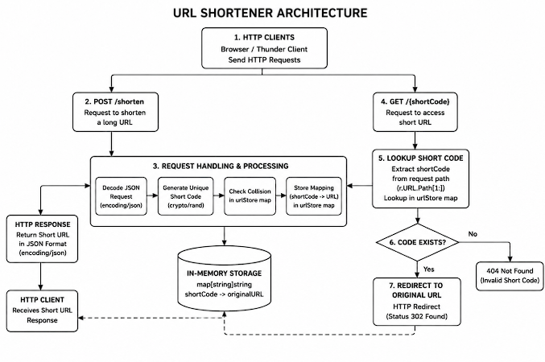

# URL Shortener

A lightweight URL Shortener built in Go using only the Go Standard Library.

This project was built from first principles to understand how HTTP servers, REST APIs, JSON, routing, and request handling work internally before using frameworks like Gin.

---

## Features

- Shorten long URLs
- Redirect short URLs to the original destination
- REST API using `net/http`
- JSON request and response handling
- Secure random short code generation using `crypto/rand`
- Collision detection for duplicate short codes
- In-memory storage
- Clean project structure

---

## Project Structure

```
url-shortener/

├── main.go
├── handlers.go
├── models.go
├── storage.go
├── utils.go
```

---

## API Endpoints

### Create Short URL

**POST** `/shorten`

Request

```json
{
    "url":"https://youtube.com"
}
```

Response

```json
{
    "short_url":"http://localhost:8080/aB9Kx2"
}
```

---

### Redirect

**GET**

```
/aB9Kx2
```

Redirects the client to the original URL.

---

## Architecture

```
Client
   │
   ▼
HTTP Request
   │
   ▼
Handler
   │
   ▼
Decode JSON
   │
   ▼
Generate Short Code
   │
   ▼
Collision Check
   │
   ▼
Store Mapping
   │
   ▼
Encode JSON
   │
   ▼
HTTP Response
```

---

## Learning Outcomes

This project helped me understand:

- HTTP request-response lifecycle
- REST API design
- Routing with `net/http`
- JSON encoding & decoding
- Struct tags
- HTTP status codes
- Redirect responses
- Go project organization
- Secure random identifier generation
- In-memory data storage

---
# PROJECT FLOW 
POST /shorten

        │
        ▼

Receive JSON

        │
        ▼

Decode Request

        │
        ▼

Generate Unique Code

        │
        ▼

Store

code -> URL

        │
        ▼

Return JSON

──────────────────────────────

GET /abc123

        │
        ▼

Lookup

abc123

        │
        ▼

Found?

     Yes      No
      │         │
      ▼         ▼
Redirect      404